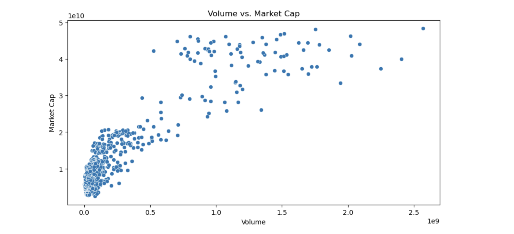
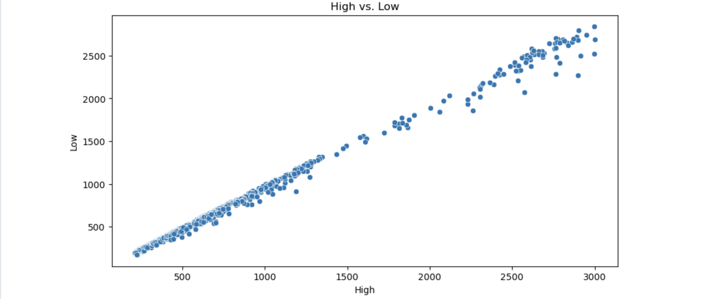
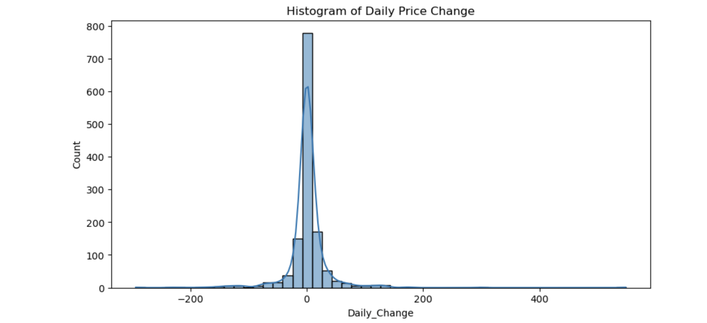
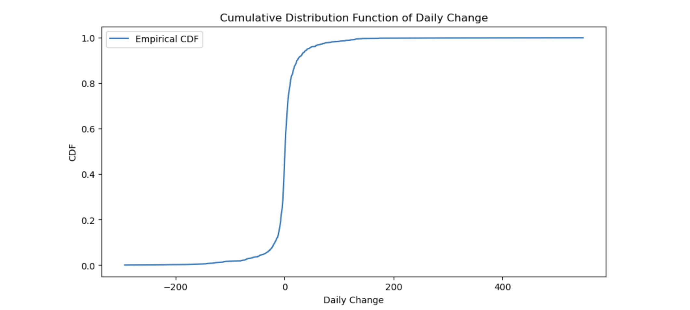
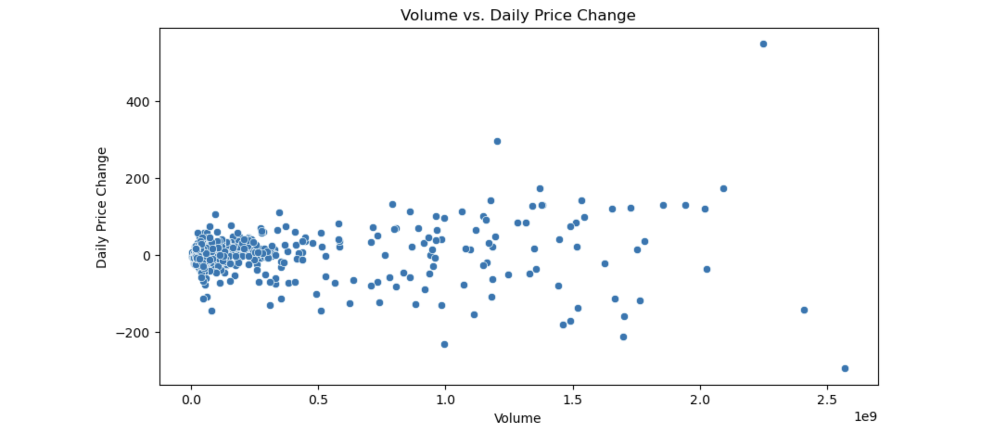
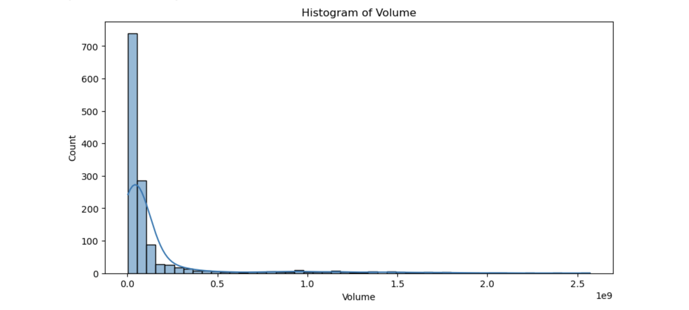

# Bitcoin Market Analytics & Statistical Modeling

## Overview

This project explores historical Bitcoin (BTC-USD) market data through statistical analysis, exploratory data analysis (EDA), probability distributions, correlation analysis, and financial market modeling.

The objective is to identify market trends, volatility patterns, trading volume relationships, and market capitalization behavior while applying data science techniques commonly used in quantitative finance and cryptocurrency analytics.

This project demonstrates practical applications of Python, statistical modeling, data visualization, and financial analytics.

---

## Business Problem

Cryptocurrency markets are highly volatile and generate large amounts of market data. Investors, analysts, and financial institutions require analytical methods to better understand:

- Price behavior
- Market volatility
- Trading activity
- Market capitalization growth
- Statistical distributions of returns
- Correlations between financial variables

This project provides a framework for analyzing Bitcoin market performance through data-driven insights.

---

## Project Objectives

- Analyze historical Bitcoin market data
- Explore statistical characteristics of cryptocurrency returns
- Identify relationships between market variables
- Detect outliers and abnormal market activity
- Visualize market trends and volatility
- Apply probability distribution analysis
- Demonstrate financial data science techniques

---

## Technologies Used

### Programming Language

- Python 3

### Data Science Libraries

- Pandas
- NumPy
- SciPy

### Visualization Libraries

- Matplotlib
- Seaborn

### Development Environment

- Jupyter Notebook

---

## Dataset Features

The dataset contains historical Bitcoin market information including:

| Feature | Description |
|----------|-------------|
| Open | Opening price |
| High | Daily high price |
| Low | Daily low price |
| Close | Closing price |
| Volume | Trading volume |
| Market Cap | Market capitalization |
| Daily Change | Daily price movement |

---

# Exploratory Data Analysis

## Volume vs Market Capitalization



This visualization examines the relationship between trading volume and market capitalization. Results indicate a strong positive association between increased trading activity and overall market growth.

---

## High vs Low Price Analysis



Analysis of daily high and low prices demonstrates an extremely strong correlation, indicating predictable relationships between intraday price ranges.

---

## Daily Price Change Distribution



Histogram analysis reveals that most daily Bitcoin price movements are concentrated around small percentage changes, with occasional extreme volatility events.

---

## Cumulative Distribution Function (CDF)



The cumulative distribution function provides insight into the probability of observing specific Bitcoin price movements.

---

## Volume vs Daily Price Change



This analysis explores the relationship between market participation and price volatility.

---

## Trading Volume Distribution



Distribution analysis highlights significant trading volume outliers and the highly skewed nature of cryptocurrency trading activity.

---

# Statistical Analysis

The project incorporates:

- Descriptive Statistics
- Correlation Analysis
- Covariance Analysis
- Probability Density Functions
- Cumulative Distribution Functions
- Outlier Detection
- Distribution Modeling

---

# Key Findings

### Market Capitalization

- Strong positive relationship with trading volume.
- Larger market capitalization generally coincides with increased trading activity.

### Daily Returns

- Daily Bitcoin returns exhibit significant kurtosis and heavy tails.
- Extreme price movements occur more frequently than expected under normal distributions.

### Volatility

- Bitcoin demonstrates substantial volatility compared to traditional financial assets.
- Large price swings create both risk and opportunity.

### Trading Activity

- Trading volume distributions are heavily right-skewed.
- Several high-volume events significantly impact market behavior.

---

# Skills Demonstrated

### Data Science

- Data Cleaning
- Exploratory Data Analysis
- Statistical Modeling
- Feature Analysis

### Machine Learning Foundations

- Data Preparation
- Statistical Inference
- Financial Data Modeling

### Visualization

- Histograms
- Scatterplots
- Distribution Analysis
- Correlation Visualization

### Finance Analytics

- Cryptocurrency Analysis
- Volatility Analysis
- Market Behavior Evaluation
- Quantitative Research

---

# Repository Structure

```text
BitcoinPriceTracker/
│
├── notebook/
│   └── BitcoinTracker.ipynb
│
├── visuals/
│   ├── volume_vs_market_cap.png
│   ├── high_vs_low.png
│   ├── histogram_daily_price_change.png
│   ├── cdf_daily_change.png
│   ├── volume_vs_daily_price_change.png
│   └── histogram_volume.png
│
├── README.md
├── requirements.txt
└── .gitignore
```

---

# Installation

Clone the repository:

```bash
git clone https://github.com/Dare215/BitcoinPriceTracker.git
```

Navigate into the project:

```bash
cd BitcoinPriceTracker
```

Install dependencies:

```bash
pip install -r requirements.txt
```

Launch Jupyter Notebook:

```bash
jupyter notebook
```

---

# Future Enhancements

- Bitcoin price forecasting
- Time series analysis
- ARIMA modeling
- LSTM neural networks
- Market sentiment integration
- Real-time cryptocurrency dashboard
- Portfolio optimization analytics

---

# Author

## Darious Brown

PhD Candidate – Technology (Artificial Intelligence & Machine Learning)

DBA Candidate

Data Scientist | AI Engineer | Machine Learning Engineer | Financial Analytics Researcher

### Connect With Me

GitHub:
https://github.com/Dare215

LinkedIn:
https://www.linkedin.com/in/dariousbrown

Portfolio:
https://dare215.github.io/DariousBrown-Portfolio/

---

## License

This project is intended for educational, research, and portfolio purposes.
